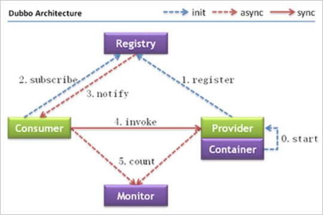

# dubbo
    1. WebService 效率不高基于soap协议，互联网项目不推荐使用。
    2. 使用resultful服务  http+json 很多项目应用   如果服务太多，服务间的调用复杂，需要服务治理。
    3. 使用dubbo，使用rpc协议进行远程调用，直接使用socket协议通信，传输效率高，并且可以统计出各个系统之间的调用关系，调用次数。

系统一定是用java写的

## 一、什么是dubbo
随着互联网的发展，网站应用的规模不断扩大，常规的垂直应用架构已无法应对，分布式服务架构以及流动计算架构势在必行，亟需一个治理系统确保架构有条不紊的演进。

单一应用架构
当网站流量很小时，只需一个应用，将所有功能都部署在一起，以减少部署节点和成本。此时，用于简化增删改查工作量的数据访问框架(ORM)是关键。
垂直应用架构
当访问量逐渐增大，单一应用增加机器带来的加速度越来越小，将应用拆成互不相干的几个应用，以提升效率。此时，用于加速前端页面开发的Web框架(MVC)是关键。
分布式服务架构
当垂直应用越来越多，应用之间交互不可避免，将核心业务抽取出来，作为独立的服务，逐渐形成稳定的服务中心，使前端应用能更快速的响应多变的市场需求。此时，用于提高业务复用及整合的分布式服务框架(RPC)是关键。
流动计算架构
当服务越来越多，容量的评估，小服务资源的浪费等问题逐渐显现，此时需增加一个调度中心基于访问压力实时管理集群容量，提高集群利用率。此时，用于提高机器利用率的资源调度和治理中心(SOA)是关键。

节点角色说明
节点|角色说明
--|:--:
Provider|暴露服务的服务提供方
Consumer|调用远程服务的服务消费方
Registry|服务注册与发现的注册中心
Monitor|统计服务的调用次数和调用时间的监控中心
Container|服务运行容器

调用关系说明
服务容器负责启动，加载，运行服务提供者。
服务提供者在启动时，向注册中心注册自己提供的服务。
服务消费者在启动时，向注册中心订阅自己所需的服务。
注册中心返回服务提供者地址列表给消费者，如果有变更，注册中心将基于长连接推送变更数据给消费者。
服务消费者，从提供者地址列表中，基于软负载均衡算法，选一台提供者进行调用，如果调用失败，再选另一台调用。
服务消费者和提供者，在内存中累计调用次数和调用时间，定时每分钟发送一次统计数据到监控中心。
Dubbo 架构具有以下几个特点，分别是连通性、健壮性、伸缩性、以及向未来架构的升级性。
连通性
注册中心负责服务地址的注册与查找，相当于目录服务，服务提供者和消费者只在启动时与注册中心交互，注册中心不转发请求，压力较小
监控中心负责统计各服务调用次数，调用时间等，统计先在内存汇总后每分钟一次发送到监控中心服务器，并以报表展示
服务提供者向注册中心注册其提供的服务，并汇报调用时间到监控中心，此时间不包含网络开销
服务消费者向注册中心获取服务提供者地址列表，并根据负载算法直接调用提供者，同时汇报调用时间到监控中心，此时间包含网络开销
注册中心，服务提供者，服务消费者三者之间均为长连接，监控中心除外
注册中心通过长连接感知服务提供者的存在，服务提供者宕机，注册中心将立即推送事件通知消费者
注册中心和监控中心全部宕机，不影响已运行的提供者和消费者，消费者在本地缓存了提供者列表
注册中心和监控中心都是可选的，服务消费者可以直连服务提供者
健壮性
监控中心宕掉不影响使用，只是丢失部分采样数据
数据库宕掉后，注册中心仍能通过缓存提供服务列表查询，但不能注册新服务
注册中心对等集群，任意一台宕掉后，将自动切换到另一台
注册中心全部宕掉后，服务提供者和服务消费者仍能通过本地缓存通讯
服务提供者无状态，任意一台宕掉后，不影响使用
服务提供者全部宕掉后，服务消费者应用将无法使用，并无限次重连等待服务提供者恢复
伸缩性
注册中心为对等集群，可动态增加机器部署实例，所有客户端将自动发现新的注册中心
服务提供者无状态，可动态增加机器部署实例，注册中心将推送新的服务提供者信息给消费者
升级性
当服务集群规模进一步扩大，带动IT治理结构进一步升级，需要实现动态部署，进行流动计算，现有分布式服务架构不会带来阻力。下图是未来可能的一种架构：

节点角色说明
节点|角色说明
--|:--:
Deployer|自动部署服务的本地代理
Repository|仓库用于存储服务应用发布包
Scheduler|调度中心基于访问压力自动增减服务提供者
Admin|统一管理控制台
Registry|服务注册与发现的注册中心
Monitor|统计服务的调用次数和调用时间的监控中心

## 二、注册中心
Zookeeper 是 Apacahe Hadoop 的子项目，是一个树型的目录服务，支持变更推送，适合作为 Dubbo 服务的注册中心，工业强度较高，可用于生产环境，并推荐使用 [1]。

动物园管理员

    1. 可以作为集群的管理工具
    2. 可以集中管理配置文件

引入dubbo和zookpper的jar包

## 三、配置服务提供方

## 四、配置服务的调用方

服务调用方需要和服务提供方一模一样的接口，包括包名。

