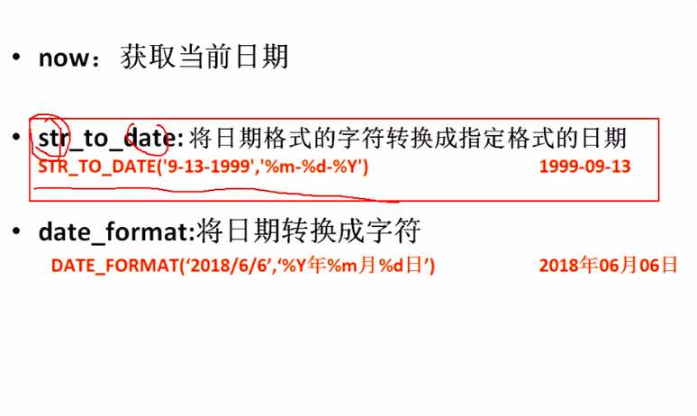
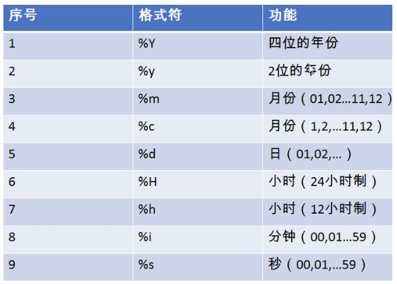
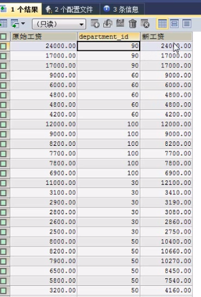
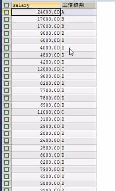

# SQL 函数
## 一、常见函数
概念：类似于java的方法，将一组逻辑语句封装在一个方法中，对外暴露方法名。

好处：1.隐藏了实现细节   2.提高了代码的重用性

调用：select 函数名（实参列表） from 表

特点：

    1.叫什么（函数名）
    2.干什么（函数功能）

分类：

    1.单行函数
    如 concat 、 length 、ifnull等
    2.分组函数

    功能：做统计使用，又称统计函数、聚合函数、组函数
    

##二.字符函数
`length（）；` 获取参数值的字节数（根据字符编码的不同而不同）

`select length（‘john’）；`

###2.concat 拼接字符串
`select concat（last_name,'_',first_name） 姓名 from employees；`

###3.upper、lower
`select upper('john');`

`select lower('joHn');`

示例：将姓变大写，名变小写，然后拼接

`select concat（upper（last_name）,lower(first_name)） 姓名 from employees ;`

###4.substr、substring
注意：索引从1开始

截取从指定索引处后面的所有字符

`select substr('李莫愁爱上了陆展元'，6) out_put;` 结果为：了陆展元

截取从指定索引处指定字符串长度的字符

`select substr（'李莫愁爱上了陆展元'，1，3） out_put;`

案例：姓名中首字母大写，其他字符小写然后用_拼接，显示出来

`select concat (upper(substr(last_name,1,1)),'_',lower(substr(last_name,2))) out_put from employees;`

###5.instr 返回子串第一次出现的索引，如果找不到返回0

`select instr ('杨不悔爱上了殷六侠'，'殷六侠') as out_put ;`

###6.trim
`select length(trim('    张翠山      ')) as out_put;`

`select trim('a' from 'aaaaaaaaa张aaaaaaaaa翠山aaaaaaaaaaaaaaa') as out_put;`

###7.lpad 用指定的字符实现左填充指定长度

`select lpad('殷素素'，10，'*') as out_put;`

###8.rpad 用指定的字符实现右填充指定长度

`select rpad('殷素素'，10，'ab') as out_put;`

###9.replace 替换

`select replace('周芷若周芷若周芷若周芷若张无忌爱上了周芷若'，'周芷若'，'赵敏') as out_put;`

## 二、数学函数
### 1.round 四舍五入
`select round(-1.65);` 结果为：-2

`select round(1.567,2);` 结果为：1.57

### 2.ceil 向上取整
`select ceil（1.002）；` 结果为：2

### 3.floor 向下取整，返回<=该参数的最大整数
`select floor(-9.99);` 结果为：-10

### 4.truncate 截断
`select truncate(1.6999,1);` 结果为：1.6

### 5.mod 取余 
mod（a，b） ： a-a/b*b

`select mod（-10，-3）；` 结果为-1

`select 10%3；`

## 三、日期函数
### 1.now 返回当前系统日期+时间
`select now（）；`

### 2.curddate 返回当前系统日期，不包含时间
`select curddate（）；`

### 3.curdtime 返回当前时间，不包含日期
`select curdtime（）；`

### 4.获取指定的部分，年、月、日、时、分、秒
`select year（now（）） 年；`

`select year（'1998-1-1'） 年；`

`select year(hiredate) 年 from employees；`

`select month（now（）） 月；`

`select mothname（now（）） 月；` 结果为 september





### 5.str_to_date 将字符通过指定的格式转换成日期

`select str_to_date('1998-3-2','%Y-%c-%d') AS out_put;`

查询入职日期为1992-4-3的员工信息

`select * from employees where hiredate = '1992-3-4';`

`select * from employees where hiredate = str_to_date('3-4 1992'，'%c-%d %Y'）;`

### 6.date_format 将日期转换成字符
`select date_format(now(),'%y年%m月%d日') AS out_put;`

查询有奖金的员工名和入职日期
（xx月/xx日 xx年）

`select last_name,date_format(hiredate,'%m月/%d日 %Y年') 入职日期 from employees  where commission_pct is not null；`

## 四、其他函数

`select version（）；`

`select database（）；`

`select user（）；`

## 五、流程控制函数
### 1.if函数  if else 的效果
`select if（10<5,'大','小'）；`

`select last_name,commisstion_pct,if（commission_pct is null,'没奖金，呵呵','有奖金，嘻嘻'） 备注 from employees;`

### 2.case函数的使用一： switch case 的效果

    case 要判断的字段或表达式
    when 常量1 then 要显示的值1或语句1；
    when 常量2 then 要显示的值2或语句2；
    ...
    else 要显示的值n或语句n；
    end

案例：

    查询员工的工资，要求：、
    部门号=30，显示的工资为1.1倍
    部门号=40，显示的工资为1.2倍
    部门号=50，显示的工资为1.3倍
```
select salary 原始工资,department_id,
case department_id
when 30 then salary*1.1
when 40 then salary*1.2
when 50 then salary*1.3
else salary
end as 新工资
from employees；
```
结果：



### case 函数使用二 ：类似于多重if
```
case 
when 条件1 then要显示的值1或语句1
when 条件2 then要显示的值2或语句2
...
else 条件n then要显示的值n或语句n
end
```

案例：查询员工的工资情况
```
如果工资>20000,显示A级别
如果工资>15000,显示B级别
如果工资>10000,显示C级别
否则，显示D级别
```
```
select salary,
case
when salary>20000 then 'A'
when salary>15000 then 'B'
when salary>10000 then 'C'
else 'D'
end as 工资级别 from employees；
```
结果：



## 三、分组函数
功能：用作统计使用，又称为聚合函数或统计函数或组函数

分类：

    sum 求和、avg平均值、max 最大值、min 最小值、count 计算个数

特点：

    1.sum、avg一般用于处理数值型
    max、min、count用于各种类型
    所有分组函数忽略null值

### 1.简单的使用
```
select sum（salary） from employees;
select avg(salary) from employees;
select min（salary） from employees;
select max(salary) from employees;
select count（salary） from employees;
```
`select sum(salary) 和,round（avg(salary)，2） 平均，min（salary） 最低，max(salary) 最高，count（salary） 个数 from employees；`

### 2.和distinct搭配

`select sum（distinct salary），sum（salary） from employees；`


`select count（distinct salary），sum（salary） from employees；`


### 3.count函数的详细介绍

`select count（salary） from employees；`

`select count（*） from employees；`

效率：

    myisam储存引擎下，count（*）的效率高
    innodb储存引擎下，count（*）和conut（1）的效率差不多，比count（字段）高一些

 查询员工表中的最大入职时间和最小入职时间的相差天数（diffrence）
 
 `select datediff（max（hiredate），min（hiredate）） ；`

 3.查询部门编号为90的员工个数

 `select count（*） from employees where department_id =90;`
 


