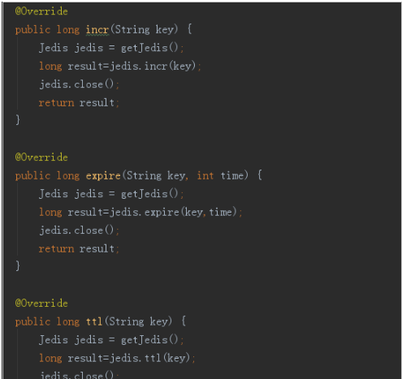

# Redis
## 一、redis介绍
NoSQL，泛指非关系型的数据库。随着互联网web2.0网站的兴起，传统的关系数据库在应付web2.0网站，特别是超大规模和高并发的SNS类型的web2.0纯动态网站已经显得力不从心，暴露了很多难以克服的问题，而非关系型的数据库则由于其本身的特点得到了非常迅速的发展。NoSQL数据库的产生就是为了解决大规模数据集合多重数据种类带来的挑战，尤其是大数据应用难题。
虽然NoSQL的流行与火起来才短短一年的时间，但是不可否认，现在已经开始了第二代运动。尽管早期的堆栈代码只能算是一种实验，然而现在的系统已经更加的成熟、稳定。不过现在也面临着一个严酷的事实：技术越来越成熟——以至于原来很好的NoSQL数据存储不得不进行重写，也有少数人认为这就是所谓的2.0版本。该工具可以为大数据建立快速、可扩展的存储库。

目前主流的nosql数据库

redis,memcahed,mongdb

1.缓存
1.redis
2.memcahed

二者的性能更好？
    1. 从缓存命中率来说memcahed更高，但是redis和memcahed相差不大。
    2. 但是，redis功能更加强大

## 二、 redis命令
多种数据类型存储

字符串存储 key value
散列存储  hash
列表存储  list
集合存储 set
     有序 
     无序  

内存存储与持久化
内存的读取速度远远高于硬盘

功能丰富
   支持缓存，存储，队列.....
支持的键的生命周期
按照一定的规则删除键

简单稳定
相比sql简单
不同语言的客户端丰富
c语言开发

Keys * 查询所有的key

Keys ?  匹配一个字符串

Exists  key  判断是否存在一个key

Del 删除键

Del key 的名字

Type 获取key的数据类型

string(字符串)  hash(散列)  list(列表)  set(集合 无序)  zset(有序的集合)

Help+空格+tab

## 三、字符串数据类型
字符串的数据类型是redis里面最基本的数据类型，它能存储任何形式的字符串。可以存储json转化的对象。一个字符串最大存储的容量是512M。

Get  Set

取值  赋值

递增数字

Incr key
当存储的字符串是整数的时候，redis提供了一个命令，起到的作用是让当前的键值增加，并且返回当前键的值。

订单表

订单id
字符串

时间+redis自增数字

Incrby xp  2

Decr 递减

Strlen key  获取字符串的长度

## 四、设置redis生命周期
设置生命周期  单位秒

Expire key  时间

Ttl key 查看剩余时间

## 五、jedis

## 六、 jedis和spring整合

