# SpringBoot
## 一、介绍
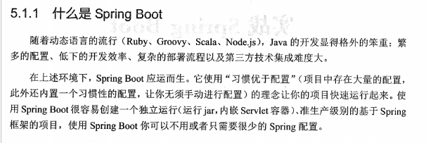
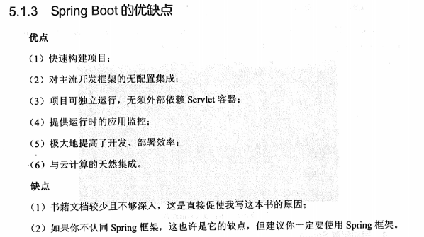

## 二、入门
pom.xml加入配置
---
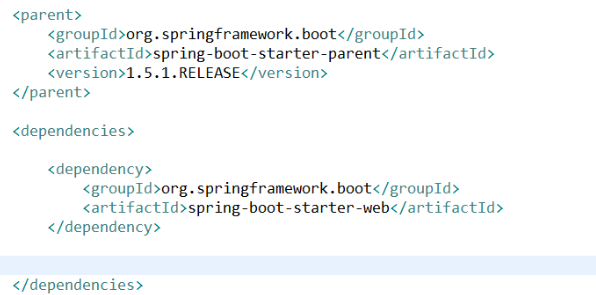
---
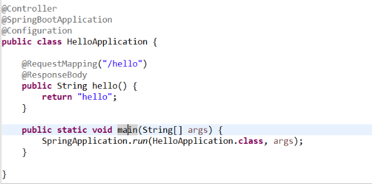
---
@SpringBootApplication  //springBoot的核心注解，主要用于开启自动配置
方式二
---
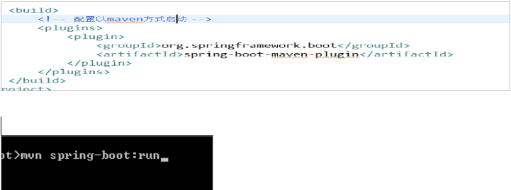

## 四、SpringBoot的核心
入门口类和SpringApplication

一个springboot项目都有一个*Application的入口类，入口类有一个主函数，这是一个标准的java程序入口。

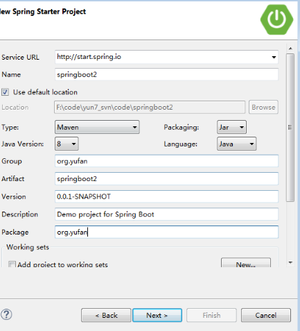
---
@SpringBootApplication注解是springBoot的核心注解
---
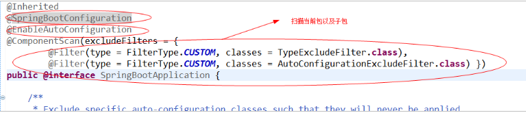
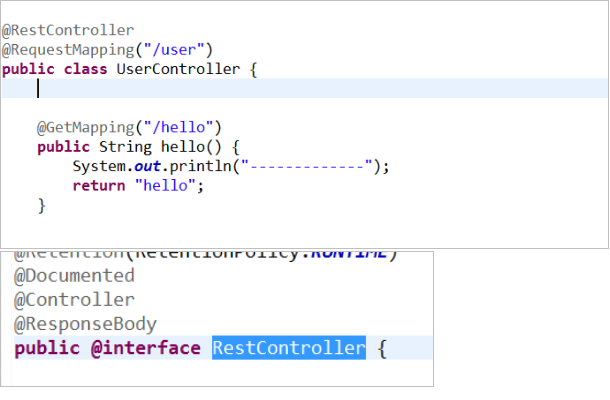

---
SpringBoot项目推荐使用springBootConfiguration替代Configuration
@EnableAutoConfiguration
 启动自动装配，该注解会使springboot根据jar包自动进行配置。
---
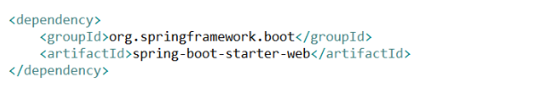
项目中就会引入springmvc的依赖，springboot就会自动配置springmvc和tomcat。
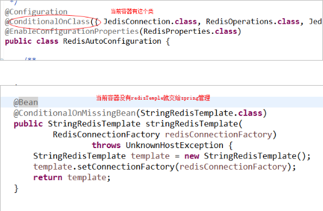
## 五、官方的start
如果想关闭某个技术的自动配置
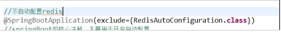

## 六、ssm整合
### 6.1配置springmvc的环境
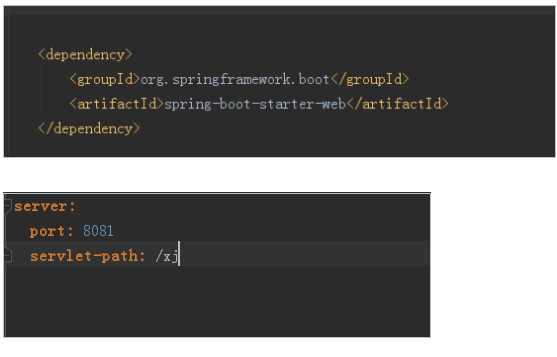

### 6.2导入jar包
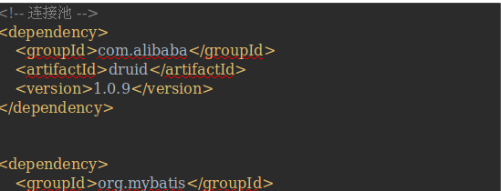
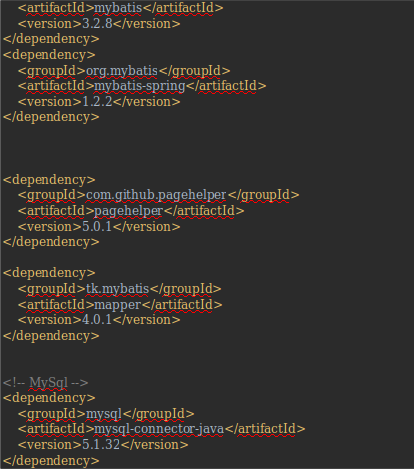

### 6.3配置数据源
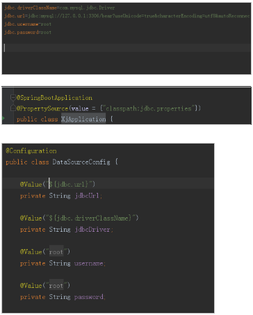
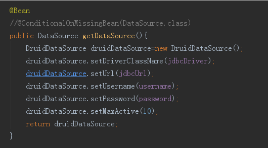
### 6.4配置sqlSessionFactory和插件
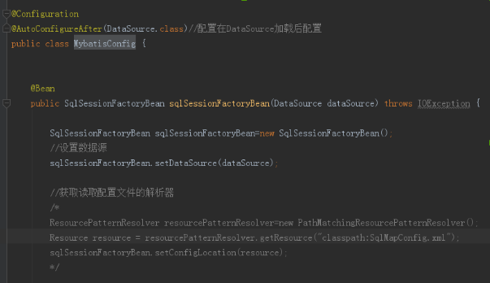
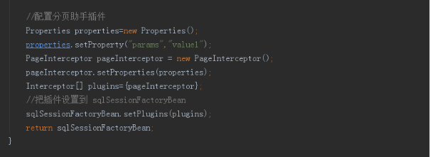
### 6.5配置扫描包
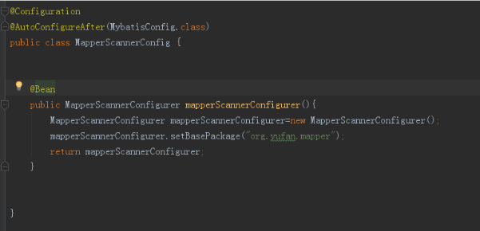
## 七、ssjpa整合
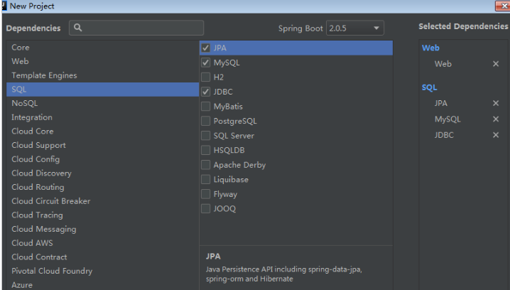
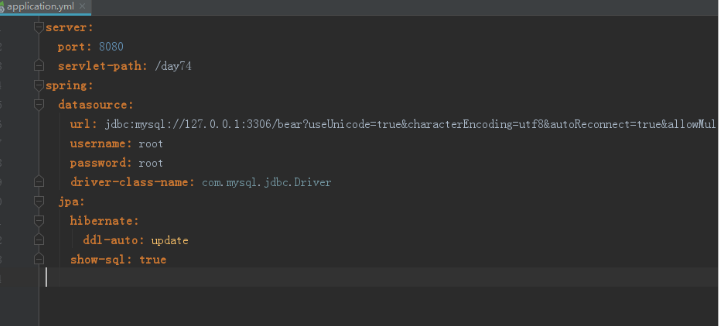
## 八、SpringBoot日志默认设置
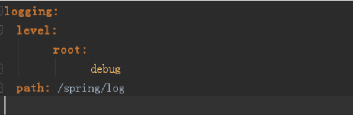
---
Springboot默认在info级别

可以配置日志文件  会自动加载日志配置文件的配置
---
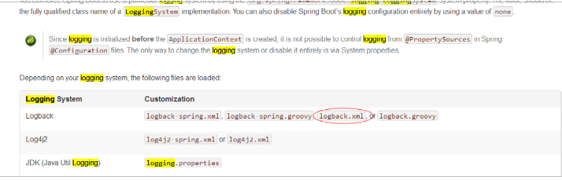

