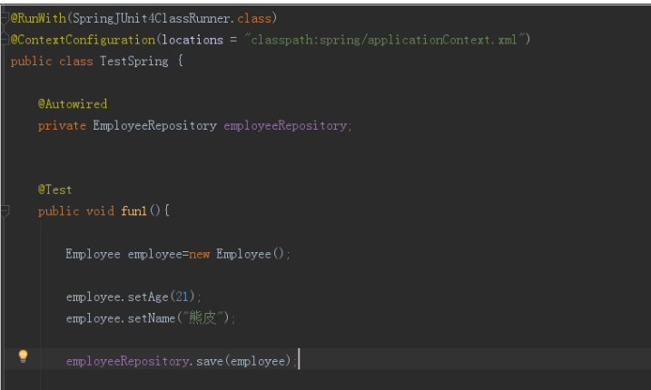

# Springdata jpa
## 一、导包

## 二、手动配置springDataJpa

## 三、入门体验

## 四、Repository  Spring  Data的核心注解
是一个空的接口，标记接口   没有包含任何方法的声明
方案一

方案二

Repository

CrudRepository   儿子  实现增删改查

PagingAndSortingRepository  孙子  排序和分页

JpaRepository  重孙   更强大

## 五、查询方法的规则的定义和使用

## 六、Query注解

## 七、实体注解的使用

