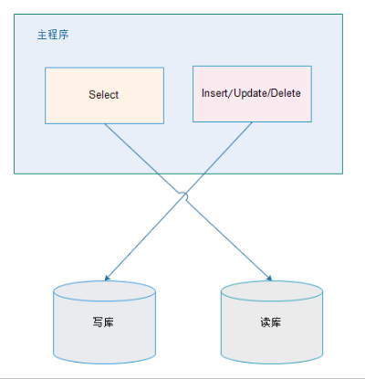
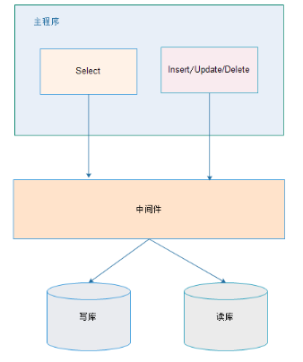
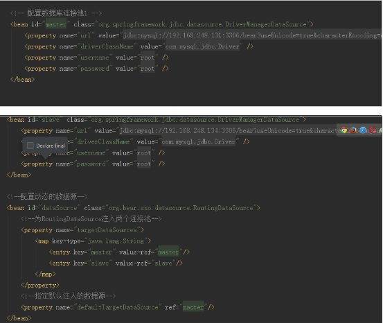
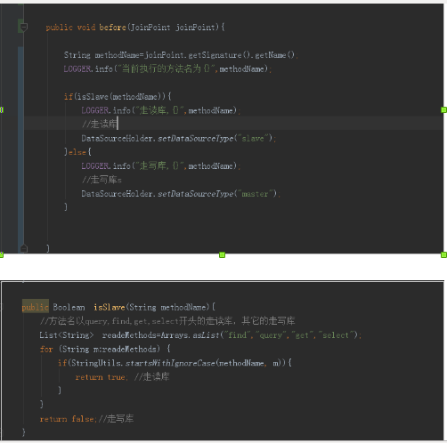

# 读写分离
## 一、原理
我们一般应用对数据库而言都是“读多写少”，也就说对数据库读取数据的压力比较大，有一个思路就是说采用数据库集群的方案，
其中一个是主库，负责写入数据，我们称之为：写库；
其它都是从库，负责读取数据，我们称之为：读库；

那么，对我们的要求是：
    1、 读库和写库的数据一致；
    2、 写数据必须写到写库；
    3、 读数据必须到读库；
方案
解决读写分离的方案有两种：应用层解决和中间件解决。

应用层解决：
---

---
优点：
    1、 多数据源切换方便，由程序自动完成；
    2、 不需要引入中间件；
    3、 理论上支持任何数据库；
缺点：
    1、 由程序员完成，运维参与不到；
    2、 不能做到动态增加数据源；

中间件解决
---

---
优缺点：

优点：
    1、 源程序不需要做任何改动就可以实现读写分离；
    2、 动态添加数据源不需要重启程序；

缺点：
    1、 程序依赖于中间件，会导致切换数据库变得困难；
    2、 由中间件做了中转代理，性能有所下降；
## 二、配置

## 三、配置通知

